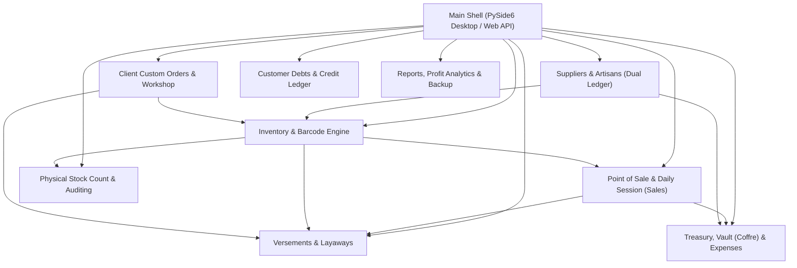
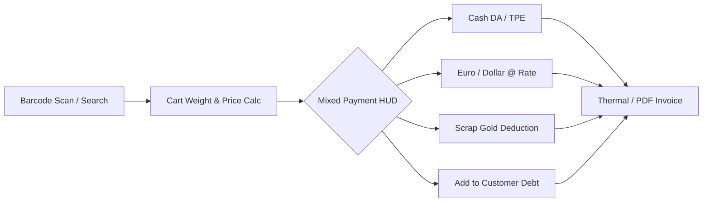
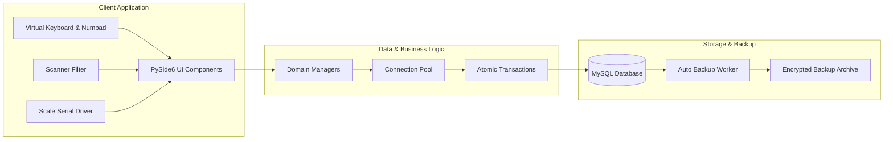
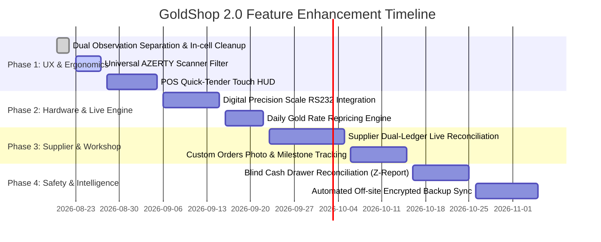

# GoldShop 2.0 — Comprehensive UX Review, Architectural Audit & Expansion Roadmap

---

## 1. Executive Summary & Core System Purpose

**GoldShop 2.0** is an enterprise-grade desktop & companion web ERP tailored specifically for the jewellery and precious metals retail and craftsmanship industry in Algeria and the MENA region. 

Unlike standard retail POS systems that treat products as discrete units with static prices, a jewellery retail environment operates under unique business rules:
1. **Dual Inventory Nature**: Items are tracked either by **exact weight in grams** (`WEIGHT`, down to milligram precision `0.001g`) or by discrete pieces (`PIECE`).
2. **Volatile Commodity Pricing**: Gold market prices (18k, 21k, 24k) fluctuate daily, meaning product selling prices depend on daily gold rates plus artisanal labor costs (*façon* per gram).
3. **Multi-Currency & Scrap Gold as Tender**: Transactions frequently involve mixed tender: Algerian Dinar (Cash DA & TPE), foreign currency (EUR, USD), and scrap/broken gold (*Or Cassé* in grams) accepted from customers as trade-in or payment.
4. **Complex Installment & Reservation Lifecycles (*Versements / Acomptes*)**: Customers reserve custom or high-value jewellery over weeks/months with periodic partial payments in cash or scrap gold, requiring continuous recalculation of deducted vs. remaining weight and distinct commercial vs. private internal annotations.
5. **Artisan & Supplier Dual-Balance Accounts**: Trade with manufacturers and artisans involves dual tracking: **pure gold balance in grams** (*Solde Or*) and **financial cash balance** (*Solde DA/Devise*), settled through work orders, deliveries, and scrap gold exchange.

---

## 2. Comprehensive Module Map & Current Architecture

| Module | Core Responsibility | Current Key Files |
| :--- | :--- | :--- |
| **Point of Sale (POS)** | Quick checkout, cash drawer sessions, barcode lookup, multi-currency / scrap gold / discount calculation, receipt & invoice generation. | [`sales_view.py`](file:///D:/git/GoldShop2.0/ui/widgets/sales/sales_view.py), [`sales_manager.py`](file:///D:/git/GoldShop2.0/database/sales_manager.py) |
| **Inventory & Catalog** | Stock item lifecycle, weight vs. piece tracking, metal types (18k/21k/24k), categories, storage locations, barcode label printing. | [`inventory_tab.py`](file:///D:/git/GoldShop2.0/ui/widgets/inventory/inventory_tab.py), [`inventory_manager`](file:///D:/git/GoldShop2.0/database/inventory_manager/) |
| **Versements (Layaway)** | Customer reservations, partial installment deductions, scrap gold valuation, commercial invoice tags vs. internal shopkeeper memos. | [`versements_view.py`](file:///D:/git/GoldShop2.0/ui/widgets/versements/versements_view.py), [`versement_manager.py`](file:///D:/git/GoldShop2.0/database/versement/versement_manager.py) |
| **Suppliers & Artisans** | Fournisseur ledger with separate Gold Weight (g) balance and Financial (DA) balance, *façon* accounting, purchase vouchers. | [`supplier_view.py`](file:///D:/git/GoldShop2.0/ui/widgets/suppliers/supplier_view.py), [`supplier_manager.py`](file:///D:/git/GoldShop2.0/database/supplier_manager.py) |
| **Client Orders (Sur Mesure)** | Custom bespoke jewellery orders, gold allocation, expected delivery scheduling, status tracking (`PENDING` to `DELIVERED`). | [`client_commands_view.py`](file:///D:/git/GoldShop2.0/ui/widgets/client_commands/client_commands_view.py), [`client_commands_manager.py`](file:///D:/git/GoldShop2.0/database/client_commands_manager.py) |
| **Stock Audit (Inventaire)** | Blind or guided physical stock count sessions, barcode scanning discrepancy resolution, automatic adjustment logging. | [`inventory_count_tab.py`](file:///D:/git/GoldShop2.0/ui/widgets/inventory_count/inventory_count_tab.py), [`inventory_count_manager`](file:///D:/git/GoldShop2.0/database/inventory_count_manager/) |
| **Treasury & Vault (*Coffre*)** | Daily opening/closing cash balances, intra-day transfers between main vault and cashier drawer, cash flow logs. | [`coffre_view.py`](file:///D:/git/GoldShop2.0/ui/widgets/coffre/coffre_view.py), [`daily_session_manager.py`](file:///D:/git/GoldShop2.0/database/daily_session_manager.py) |
| **Repairs & Workshop** | Jewellery repairs, resizing, stone replacement, tracking items sent to and received from workshops. | [`artisan_work_view.py`](file:///D:/git/GoldShop2.0/ui/widgets/artisan_work/artisan_work_view.py), [`artisan_work_manager.py`](file:///D:/git/GoldShop2.0/database/artisan_work_manager.py) |

---

## 3. Detailed UX Shortcomings & Pain Points Analysis

### 3.1. Touchscreen & POS Ergonomics
* **The "Mystery Icon" Problem**: Several views historically presented icon-only buttons in top bars or context menus without textual labels. Cashiers on busy shifts or touchscreen stations struggle with icon recognition without hover tooltips.
* **AZERTY Scanner Keyboard Layout Conflicts**: French/Arabic Windows keyboards translate standard barcode reader numeric output into symbols (`&`, `é`, `"`, `'`, `(`, `-`, `è`, `_`, `ç`, `à`). While handled in certain inputs, global inputs throughout dialogs require systematic transparent normalization.
* **Modal Dialog Keyboard Obscuration**: When virtual on-screen keyboards (`VirtualKeyboardDialog` / `VirtualNumpad`) appear, low-resolution touchscreens (1366×768 or 1080p) risk obscuring form fields and confirmation buttons (`Enregistrer` / `Valider`).
* **In-Cell Overcrowding vs. Direct Action**: Embedding heavy button widgets directly inside table cells creates visual clutter and performance lags on large datasets; instead, clean informative text paired with top-bar contextual actions and direct double-click triggers delivers the best user experience.

### 3.2. Data Separation & Business Realism
* **Commercial Note vs. Internal Memos**: Shopkeepers frequently need two distinct notes for a reserved or sold piece:
  1. *Commercial Invoice Note*: Appears on customer-facing printouts (e.g. `"Gravure: Sara & Ali"`, `"À Vendre"`, `"Garantie 2 ans"`).
  2. *Internal Shopkeeper Observation*: Private memo for delicate or severe situations (e.g. `"Client exigeant"`, `"Fermoir fragile à vérifier"`, `"Avance promise pour le 15"`).
* **Multi-Currency Mixed Payment Clarity**: Cashiers accepting mixed payments (DA cash + € + $ + gold scrap) need immediate visual validation of the equivalent conversion rate and remaining balance in real time without cognitive overload.

### 3.3. Inventory & Pricing Dynamics
* **Daily Gold Price Fluctuations**: If the market gold rate increases by 200 DA/g, manually recalculating hundreds of inventory pieces is unfeasible. A one-click bulk repricing wizard based on Karat + Margin/Gram is needed.
* **Scale Weighing Human Error**: Manual weight entry (e.g., typing `3.450g` instead of `3.540g`) can cause financial losses. Lack of direct hardware scale communication is a major operational vulnerability.

---

## 4. Prioritized Improvement & Expansion Cases

### Case 1: POS High-Speed Touchscreen Checkout & Smart Barcode Engine
> **Goal**: Accelerate checkout times, eliminate barcode scanning errors, and streamline mixed-tender transactions.

* **Universal Scanner Filter**: Install a transparent Qt application-level event filter that intercepts scanner input regardless of active keyboard layout (AZERTY / QWERTY / Arabic) and auto-routes scans to the cart.
* **Split Tender Touch HUD**: A unified payment modal displaying:
  * Cash (DA) with quick-cash denomination buttons (`1000`, `2000`, `5000`, `10000`, `20000 DA`).
  * Electronic Terminal (TPE / CIB).
  * Foreign Currency (€ / $) with live rate multiplier.
  * Trade-in Scrap Gold (*Or Cassé*) with automatic purity-to-value calculation.
* **Instant Customer Autocomplete**: Smart phone/name search with debt & versement warning badges directly inside the POS screen.

---

### Case 2: Advanced Versement (Layaway) Management & Visual Allocation HUD
> **Goal**: Complete transparency over multi-item dossiers, layaway installments, and dual-note support.

* **Dual-Field Annotation**:
  * **Facture / Tag**: Public note stored in `notes` and synchronized with `SaleItems.custom_note`.
  * **Observation Interne**: Private shopkeeper memo stored in `Versement_Items.observation` for customer relationship history.
* **Visual Weight Allocation Progress Bar**: For multi-article layaways, visual progress bars showing percentage and grams deducted for each reserved piece.
* **Automatic SMS / WhatsApp Notification Assistant**: Quick button to generate French/Arabic payment reminder messages with dossier summary (`VRS-00012`, remaining balance, pickup deadline).

---

### Case 3: Live Gold Rate Engine & Hardware Scale (RS232) Integration
> **Goal**: Automate weight input from precision scales and ensure dynamic catalog valuation.

* **Direct Digital Scale Bridge**: Direct serial communication (`pyserial` on COM port) reading live weights from laboratory/jewellery scales (e.g., Kern, Ohaus, Sartorius, CAS) with a "Capture Weight" button to guarantee zero typing error.
* **Catalog Repricing Simulator**:
  * Input new 18k / 21k / 24k market rate.
  * Preview profit margin impact across all inventory categories.
  * Apply bulk price update across selected categories in a single atomic database transaction.

---

### Case 4: Supplier & Artisan Dual-Ledger Live Reconciliation Portal
> **Goal**: Eliminate spreadsheet reliance for manufacturer accounts with strict Pure Gold + Cash balance tracking.

* **Dual Balance Matrix**:
  * **Solde Or Fin (24k / 18k Eq)**: Grams owed to or by the supplier.
  * **Solde Monétaire (DA / Devise)**: Labor fees (*Façon*) and cash settlements.
* **Artisan Work Order Dispatch**:
  * Log scrap gold handed to artisan (`Poids Métal Remis`).
  * Receive finished jewellery pieces with calculated wastage (*Déchet*) and manufacturing labor cost.
* **One-Click Account Statement PDF**: Generate branded supplier reconciliation statements ready for signing.

---

### Case 5: Bespoke Orders (Sur Mesure) with Visual Photo Capture
> **Goal**: Full traceability of custom client fabrication and repairs.

* **Camera / Webcam Capture**: Integrate direct image capture from webcam or mobile upload for custom ring/necklace design sketches, stone placement, and hallmark inspection.
* **Order Lifecycle Milestones**:
  * `CONFIRMED` -> `GOLD_ALLOCATED` -> `WORKSHOP_IN_PROGRESS` -> `READY_FOR_PICKUP` -> `DELIVERED`.
* **Integrated Deposit Accounting**: Link advance payments directly to the daily session cash box.

---

### Case 6: Real-time Stock Inventory Audits (Blind & Guided Counts)
> **Goal**: Prevent stock shrinkage and pinpoint location-based discrepancies.

* **Continuous Audit Mode**: Perform rolling inventory audits by tray/location (*Vitrine A*, *Coffre B*, *Tiroir 3*) without halting shop sales.
* **Discrepancy Resolution Wizard**:
  * Identify missing tags vs. extra unrecorded pieces.
  * Instant action to declare item as lost, update weight discrepancy, or re-assign storage location.

---

### Case 7: End-of-Day Blind Cash & Gold Reconciliation (Z-Report)
> **Goal**: Maximum anti-fraud security and accounting compliance.

* **Blind Count Closing**: Cashier enters actual physical cash (DA, EUR, USD) and scrap gold in the drawer before viewing the system's theoretical numbers.
* **Discrepancy Reporting**: Generates a detailed audit variance log with supervisor sign-off for any difference between physical and expected funds.
* **Automatic Cloud / Off-Site Backup**: Automatic encrypted database export to Google Drive / OneDrive or secondary NAS drive upon session close.

---

## 5. Technical Architecture & Data Safety Guidelines

1. **Transaction Atomicity**: All multi-table operations (e.g. closing a versement, generating a sale, deducting inventory, updating daily sessions) must strictly execute within `conn.autocommit = False` transaction blocks with explicit `commit()` and `rollback()`.
2. **Schema Migration Safety**: All table adjustments must use `ALTER TABLE ... ADD COLUMN IF NOT EXISTS` or idempotent query lists in `tables.py` to prevent errors on long-standing production databases.
3. **Responsive Geometry**: Dialogs must enforce minimum resolution compatibility (1024×768) with scrollable viewports (`QScrollArea`) to ensure no UI elements are clipped on POS touchscreens.

---

## 6. Implementation Roadmap & Phases

---

## 7. Conclusion

By systematically addressing touchscreen ergonomics, separating commercial vs. private customer notes, integrating scale hardware, and providing strict dual-balance accounting for suppliers and layaways, **GoldShop 2.0** provides a robust, seamless, and high-performance management solution tailored for modern jewellery businesses.
